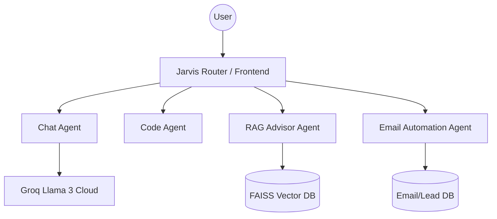

# DKnexAI — Multi-Agent AI Automation Platform 🚀

DKnexAI is a high-performance, multi-agent ecosystem designed to automate complex business workflows, provide intelligent data retrieval, and assist in technical development. It leverages a specialized router architecture to delegate tasks to autonomous agents optimized for specific domains.

---

## 🔹 Overview

DKnexAI is more than just a chatbot; it's a comprehensive **Multi-Agent AI Automation Platform**. It unifies diverse AI capabilities into a single interface, allowing users to move seamlessly between general assistance, technical coding, deep document research (RAG), and complex email automation.

*   **Intelligent Routing:** Tasks are directed to the most qualified agent.
*   **Domain Expertise:** Each agent is fine-tuned with specific system prompts and safety constraints.
*   **Data-Driven:** Integrated RAG (Retrieval-Augmented Generation) allows the platform to "read" and reason over your private documents.

---

## 🔹 Features

✅ **RAG Advisor Agent:** Intelligent document retrieval using FAISS and Groq. Perfect for analyzing technical manuals or medical encyclopedias.
✅ **AI Chat Agent:** General-purpose conversational assistant for brainstorming and daily tasks.
✅ **AI Code Agent:** Senior-level engineering assistant that generates production-ready code and debugs complex logic.
✅ **AI Email Automation Agent:** Automates lead classification, draft generation, and follow-up scheduling.
✅ **Role-Based Dashboard:** Secure admin and staff views for managing leads and agents.
✅ **Lead Management:** End-to-end tracking of business opportunities with automated reporting.

---

## 🔹 Architecture

DKnexAI uses a hub-and-spoke model where a central logic layer (Jarvis Router) manages specialized microservices.



---

## 🔹 Tech Stack

### **Backend (Microservices)**
*   **Python (FastAPI):** High-speed API endpoints for AI agents.
*   **Java (Spring Boot):** Core business logic and enterprise-level management.
*   **Groq SDK:** Ultra-fast LLM inference using Llama 3 models.

### **AI & Data**
*   **LangChain / LangGraph:** Agentic workflow orchestration.
*   **FAISS:** High-performance vector similarity search.
*   **Sentence-Transformers:** Local embedding generation.

### **Frontend**
*   **Angular / HTML5 / Vanilla CSS:** Modern, responsive dashboard with premium glassmorphism aesthetics.
*   **JavaScript:** Real-time interactivity and API integration.

---

## 🔹 Installation

### 1. Clone the Repository
```bash
git clone https://github.com/Dhyanakartheek/DKnexAI.git
cd DKnexAI
```

### 2. Environment Setup
Create a `.env` file in the root directory and add your API keys:
```text
GROQ_API_KEY=your_key_here
```

### 3. Run the Agents
Each agent can be started independently. For example, to run the RAG agent:
```bash
cd Agent_rag
pip install -r requirements.txt
python -m app.main
```

---

## 🔹 Future Plans
- [ ] **Multi-Modal Support:** Image and Document analysis across all agents.
- [ ] **Custom Knowledge Upload:** Direct UI interface for users to upload PDFs to the RAG agent.
- [ ] **Voice Integration:** Hands-free command and control for the automation platform.
- [ ] **Expanded Integrations:** Native connectors for Slack, Discord, and Microsoft Teams.

---

*Developed with ❤️ by the DKnex AI Team*
